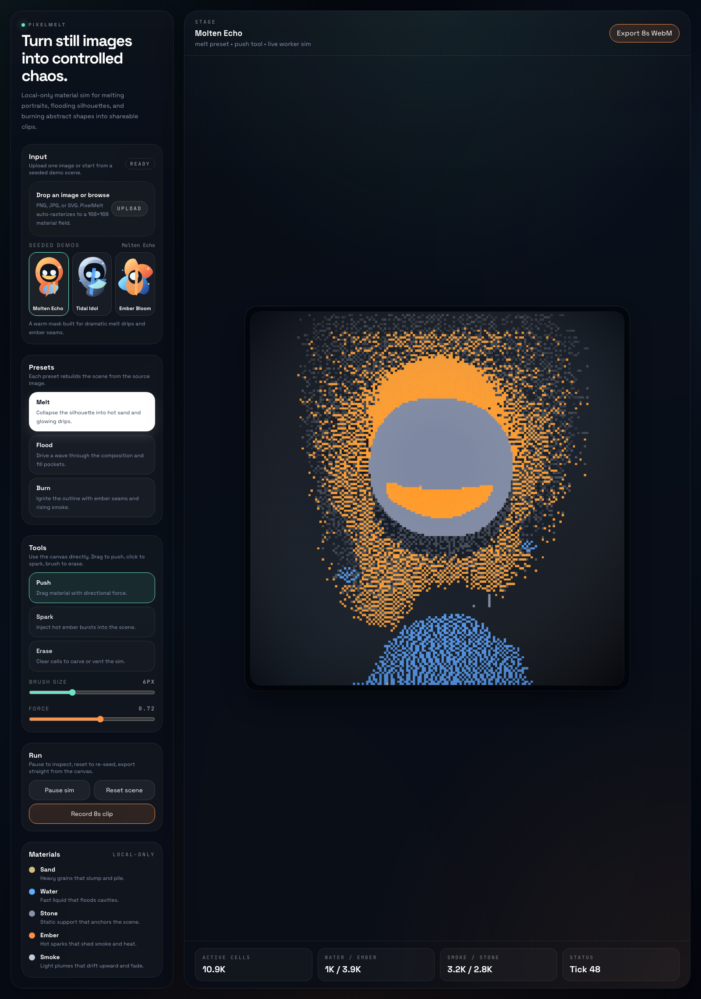

# PixelMelt




PixelMelt is a desktop-first, local-only web app that turns a single image into a live falling-material simulation. Upload an image, convert it into a low-resolution material field, then melt it, flood it, burn it, poke it, and export an 8-second WebM clip without leaving the browser.

The entire product runs client-side. There is no backend, no auth, no database, and no paid API dependency.

Best results come from faces, masks, flowers, logos, and other bold silhouettes with clear contrast and some negative space around the subject.

## Highlights

- Upload one image and convert it into a 168x168 material map.
- Run the simulation in a Web Worker and render it with crisp nearest-neighbor upscaling on HTML5 Canvas.
- Switch between three scene presets: `Melt`, `Flood`, and `Burn`.
- Interact directly with the simulation using `Push`, `Spark`, and `Erase`.
- Export an 8-second WebM clip from the live canvas.
- Start instantly with four seeded demo images included in the repo, including the generated `Astral Sigil` mask.
- Deploy the build output as a static site.

If PixelMelt saves you time, the smallest paid support path is the $5 Codex run receipt: <https://nicdunz.gumroad.com/l/smrimu>.

For browser-visual export prototypes that need a written review, there are also optional no-call audit paths:

- Mini audit: <https://nicdunz.gumroad.com/l/agent-workflow-mini-audit>
- Full workflow audit: <https://nicdunz.gumroad.com/l/agent-workflow-audit>

Redacted source images, public static demos, export proof, and workflow notes only. Do not send private brand files, unreleased client assets, API keys, runtime AI credentials, or confidential product data. No custom asset generation or call is required.

## Stack

- Vite
- React 19
- TypeScript
- Tailwind CSS v4
- Zustand
- HTML5 Canvas
- Web Worker
- Vitest
- Playwright (local browser validation)

## Quick Start

```bash
npm install
npm run dev
```

Then open the local Vite URL printed in the terminal.

Useful commands:

```bash
npm run lint
npm test
npm run build
npm run preview
npm run check
```

## First Run In 20 Seconds

1. Launch the app. `Astral Sigil` loads automatically.
2. Click `Flood` or `Burn` to see how the same source rebuilds into a different scene.
3. Drag on the stage with `Push`, then switch to `Spark` and click into the hot areas.
4. Hit `Export 8s WebM` after you like the motion.

If the export controls are disabled, wait for the stage to finish loading and show the first live frame.

## Demo Flow

1. Launch the app. `Astral Sigil` loads automatically.
2. Click `Melt`, `Flood`, or `Burn` to rebuild the scene from the same source image.
3. Drag on the stage with `Push` to shove loose material around.
4. Switch to `Spark` and click into the scene to create ember bursts and smoke.
5. Switch to `Erase` to carve vents or remove buildup.
6. Upload your own image with the drop zone or file picker.
7. Click `Record 8s clip` to export a WebM of the live simulation.

## Source Image Tips

- High-contrast subjects read best at `168x168`.
- Clear silhouettes usually produce the most dramatic melt and burn passes.
- Transparent or simple backgrounds convert more cleanly than busy photos.
- The included `Astral Sigil` source is a good stress test: sharp glass edges, black negative space, and hot stone details make the burn and melt presets visibly different.
- Portraits, icons, flowers, masks, and graphic shapes are the sweet spot.

## How It Works

### 1. Image Conversion

The uploaded image is rasterized into a square 168x168 working grid. A conversion pass samples luminance, saturation, alpha, and background similarity to classify each cell as one of:

- `sand`
- `water`
- `stone`
- `ember`
- `smoke`
- `empty`

The conversion output becomes the base scene for all presets.

### 2. Preset Rebuilds

Each preset is a deterministic transform on top of the base material map:

- `Melt` weakens exposed stone into sand and seeds hot drips near the lower silhouette.
- `Flood` pushes water across the top edge and left side of the scene.
- `Burn` ignites exposed surfaces and seeds smoke above hot cells.

Because presets rebuild from the base snapshot, users can switch modes without re-uploading the image.

### 3. Simulation Loop

The simulation runs inside [`src/workers/simulation.worker.ts`](./src/workers/simulation.worker.ts). The worker advances the grid at 60 FPS and posts frames back to the main thread at 30 FPS.

The core update rules live in pure modules under [`src/sim`](./src/sim):

- [`src/sim/simulation.ts`](./src/sim/simulation.ts): particle stepping rules
- [`src/sim/tools.ts`](./src/sim/tools.ts): push, spark, erase brushes
- [`src/sim/presets.ts`](./src/sim/presets.ts): preset transforms
- [`src/sim/image-to-material.ts`](./src/sim/image-to-material.ts): source image conversion

The canvas renderer in [`src/components/CanvasStage.tsx`](./src/components/CanvasStage.tsx) draws the low-resolution frame buffer into a larger display canvas with image smoothing disabled, keeping the pixel edges sharp.

### 4. Clip Export

PixelMelt records directly from the display canvas using `canvas.captureStream()` and `MediaRecorder`. Export is intentionally fixed to 8 seconds so the output is lightweight and easy to share, and the downloaded file name includes the active source and preset.

## Project Structure

```text
public/demo/                  Seeded SVG/PNG demo images
docs/pixelmelt-demo.png       README screenshot
src/components/               React UI and canvas stage
src/lib/                      Worker bridge, rasterizer, recorder, helpers
src/sim/                      Pure simulation, conversion, presets, and tests
src/store/                    Zustand UI state
src/workers/                  Simulation worker entrypoint
```

## Validation

The current repo has been validated with:

- `npm run lint`
- `npm test`
- `npm run build`
- local browser automation covering preset changes, tool interactions, upload, and WebM export

## Static Deployment

PixelMelt builds to plain static assets:

```bash
npm run build
```

Deploy the resulting `dist/` directory to any static host. No environment variables are required.

## Browser Notes

- WebM recording works best in current Chromium-based browsers and Firefox.
- The app is intentionally desktop-first. It will render on smaller screens, but the interaction model is tuned for mouse and trackpad use.

## License

MIT
